# Data Collector Core — Architecture

## Overview

The Data Collector is a **system-privileged headless foreground service** for Porsche AAOS infotainment systems. It runs as **user 0** (`singleUser=true`) and collects vehicle, system, media, network, and sensor data through a pluggable collector architecture, emitting structured telemetry events.

## Architecture Diagram

```mermaid
graph TB
    subgraph USER0["User 0 · System"]
        direction TB

        subgraph "DataCollector Service"
            direction TB
            BOOT["BootReceiver<br/><i>BOOT_COMPLETED / LOCKED_BOOT_COMPLETED</i>"]
            SVC["DataCollectorService<br/><i>Foreground Service · singleUser=true</i><br/><i>START_STICKY · specialUse</i>"]
            SCOPE["ServiceScope<br/><i>SupervisorJob + Dispatchers.Default</i>"]

            BOOT -->|"startForegroundService()"| SVC
            SVC -->|"startCollectors()"| SCOPE
        end

        subgraph "Hilt DI"
            direction TB
            CMOD["CollectorModule<br/><i>@Binds @IntoSet × 14</i>"]
            TMOD["TelemetryModule<br/><i>LogTelemetry → Telemetry</i>"]
            LMOD["LoggingModule<br/><i>LogcatLogger → Logger</i>"]

            subgraph "Flavor-specific · app/src/{mock,real}/"
                VMOD_MOCK["MockVehiclePlatformModule<br/><i>FakeVhalPropertyService</i>"]
                VMOD_REAL["RealVehiclePlatformModule<br/><i>CarPropertyAdapter</i>"]
            end
        end

        CMOD -->|"Set&lt;Collector&gt;"| SVC
        TMOD -->|"Telemetry"| SVC
        LMOD -->|"Logger"| SVC

        subgraph "Config Map"
            direction LR
            CFG_ON["Enabled ✓<br/>Audio · TouchInput · MediaPlayback"]
            CFG_OFF["Disabled ✗<br/>AppLifecycle · CarInfo · Connectivity<br/>DriveState · Memory · NetworkStats<br/>Package · Process · SensorBattery<br/>Telephony · VehicleProperty"]
        end

        SCOPE --> CFG_ON
        SCOPE -.->|"skipped"| CFG_OFF

        subgraph "Vehicle Domain"
            direction TB
            C_VP["VehiclePropertyCollector<br/><i>Speed · RPM · Gear · Fuel · HVAC · Lights</i>"]
            C_DS["DriveStateCollector<br/><i>Speed · Parking Brake</i>"]
            C_CI["CarInfoCollector<br/><i>VIN · Make · Model (one-shot)</i>"]
        end

        subgraph "Media Domain"
            direction TB
            C_MP["MediaPlaybackCollector<br/><i>Sessions · State · Metadata</i>"]
        end

        subgraph "System Domain"
            direction TB
            C_AU["AudioCollector<br/><i>Volumes · Devices · CarAudioManager</i>"]
            C_TI["TouchInputCollector<br/><i>Per-display touch via InputMonitor</i>"]
            C_AL["AppLifecycleCollector<br/><i>Foreground/Background events</i>"]
            C_PR["ProcessCollector<br/><i>Running processes</i>"]
            C_MEM["MemoryCollector<br/><i>RAM usage</i>"]
            C_PKG["PackageCollector<br/><i>Installed apps</i>"]
            C_TEL["TelephonyCollector<br/><i>Call state · signal</i>"]
            C_SB["SensorBatteryCollector<br/><i>Accel · Gyro · Battery</i>"]
            C_CON["ConnectivityCollector<br/><i>Network state</i>"]
        end

        subgraph "Network Domain"
            direction TB
            C_NS["NetworkStatsCollector<br/><i>WiFi/Mobile usage per app</i>"]
        end

        CFG_ON --> C_AU & C_TI & C_MP

        subgraph "Android Framework · AAOS"
            direction TB
            CAR_SVC["Car Service<br/><i>CarAudioManager · CarPropertyManager</i>"]
            INPUT_MGR["InputManager<br/><i>monitorGestureInput() · @SystemApi</i>"]
            DISPLAY_MGR["DisplayManager<br/><i>4 displays</i>"]
            AUDIO_MGR["AudioManager"]
        end

        C_AU -->|"CarVolumeCallback"| CAR_SVC
        C_AU -->|"stream volumes"| AUDIO_MGR
        C_TI -->|"reflection: monitorGestureInput()"| INPUT_MGR
        C_TI -->|"enumerate displays"| DISPLAY_MGR
        C_VP -->|"VhalPropertyService"| CAR_SVC
        C_DS -->|"VhalPropertyService"| CAR_SVC
        C_CI -->|"VhalPropertyService"| CAR_SVC
    end

    subgraph USER10["User 10 · Foreground HU User"]
        direction TB
        MEDIA_SESS["MediaSessionManager<br/><i>Active sessions (4–20)<br/>populated by media/UI apps on this user</i>"]
    end

    C_MP -->|"reflection: getActiveSessionsForUser(user 10)<br/>INTERACT_ACROSS_USERS_FULL"| MEDIA_SESS

    subgraph "Telemetry Pipeline"
        direction LR
        TEL_IF["Telemetry Interface<br/><i>.send(TelemetryEvent)</i>"]
        LOG_TEL["LogTelemetry<br/><i>Logcat output</i>"]
        FUTURE["Future: HTTP / gRPC / File"]
    end

    C_AU & C_TI & C_MP --> TEL_IF
    C_VP & C_DS & C_CI --> TEL_IF
    TEL_IF --> LOG_TEL
    TEL_IF -.->|"swap impl"| FUTURE

    subgraph "Gradle Modules"
        direction LR
        MOD_APP[":app<br/><i>Service · Collectors · DI</i>"]
        MOD_VP[":vehicle-platform<br/><i>VhalPropertyService<br/>CarPropertyAdapter</i>"]
        MOD_VC[":vehicle-connectivity<br/><i>RSI/ASI signals · MIB4</i>"]
        MOD_LOG[":core-logging<br/><i>Logger · LogcatLogger</i>"]
        MOD_COM[":core-common<br/><i>(reserved)</i>"]
        MOD_TST[":core-testing<br/><i>NoOpLogger · extensions</i>"]
    end

    MOD_APP --> MOD_VP & MOD_VC & MOD_LOG & MOD_COM
    MOD_VP --> MOD_LOG
    MOD_VC --> MOD_LOG

    subgraph "Emulator Displays"
        direction LR
        D0["Display 0<br/>Center 1920×720"]
        D1["Display 1<br/>Cluster 1280×768"]
        D2["Display 2<br/>Passenger 1920×1080"]
        D3["Display 3<br/>Rear 1920×720"]
    end

    DISPLAY_MGR --> D0 & D1 & D2 & D3

    style USER0 fill:#1a1a2e,color:#fff,stroke:#4a6fa5
    style USER10 fill:#2e1a1a,color:#fff,stroke:#a54a4a
    style CFG_ON fill:#2d6a2d,color:#fff
    style CFG_OFF fill:#6a2d2d,color:#fff
    style C_AU fill:#2d6a2d,color:#fff
    style C_TI fill:#2d6a2d,color:#fff
    style C_MP fill:#2d6a2d,color:#fff
    style MEDIA_SESS fill:#a54a4a,color:#fff
    style FUTURE fill:#555,color:#fff,stroke-dasharray: 5 5
```

## User Context Model

| User | Role | What runs there |
|------|------|----------------|
| **User 0** | System user | `DataCollectorService`, `BootReceiver`, all collectors, Car Service, VHAL |
| **User 10+** | Foreground (HU) user | Media apps, UI apps, `MediaSessionManager` sessions |

The service is marked `singleUser="true"` — Android only instantiates it for user 0 regardless of which user triggers the intent. Cross-user access to media sessions requires `INTERACT_ACROSS_USERS_FULL` and reflection on `MediaSessionManager.getActiveSessionsForUser(ComponentName, UserHandle)`.

## Collector Summary

| Domain | Collector | Event ID | Trigger | Cross-user |
|--------|-----------|----------|---------|------------|
| Vehicle | VehiclePropertyCollector | `vehicle.property` | VHAL callback | No |
| Vehicle | DriveStateCollector | `vehicle.drive_state` | VHAL callback | No |
| Vehicle | CarInfoCollector | `vehicle.car_info` | One-shot | No |
| Media | MediaPlaybackCollector | `media.playback_state`, `media.metadata` | MediaController callback | **Yes** (user 10) |
| System | AudioCollector | `audio.state` | CarVolumeCallback + 10s poll | No |
| System | TouchInputCollector | `input.touch` | InputEventReceiver | No |
| System | AppLifecycleCollector | `app.lifecycle` | 2s poll | No |
| System | ProcessCollector | `system.processes` | 1s poll | No |
| System | MemoryCollector | `system.memory` | 5s poll | No |
| System | PackageCollector | `system.packages` | BroadcastReceiver | No |
| System | TelephonyCollector | `telephony.state` | PhoneStateListener | No |
| System | SensorBatteryCollector | `sensor.*`, `battery.state` | SensorEventListener | No |
| System | ConnectivityCollector | `network.connectivity` | NetworkCallback | No |
| Network | NetworkStatsCollector | `network.stats` | 10s poll | No |
