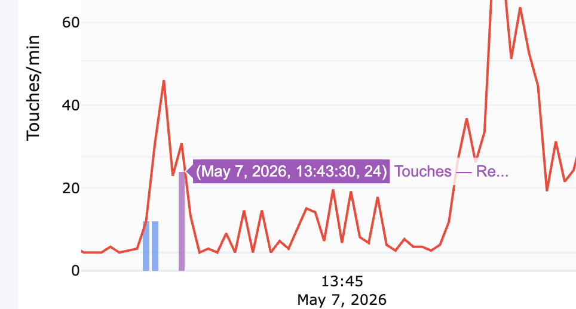
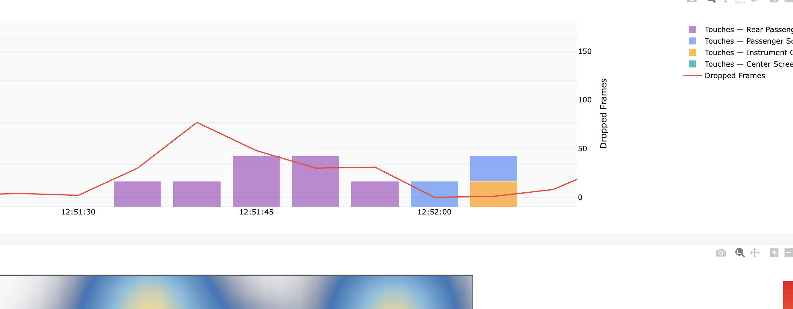
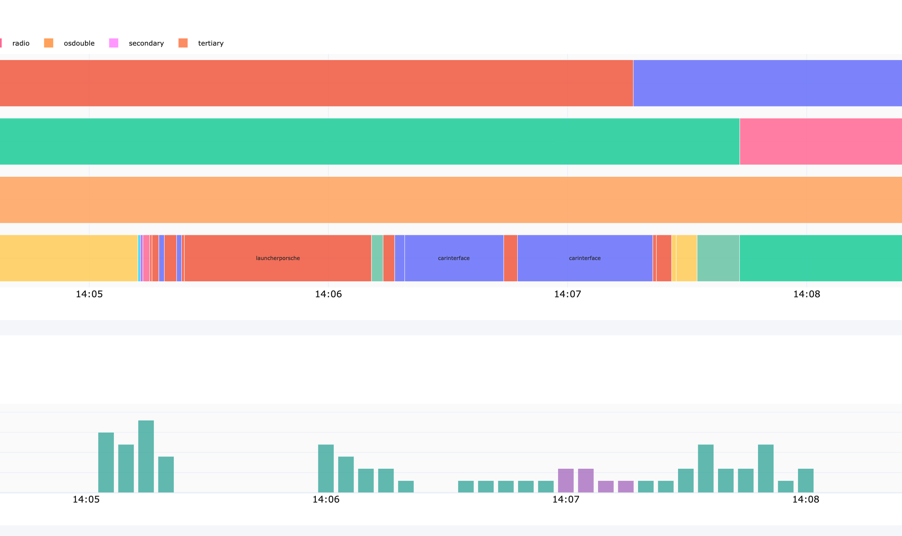

# Dashboard — Open TODOs

Issues and feature requests for the telemetry analytics dashboard (`telemetry_analysis/code/dashboard.py`).
Last updated: 2026-05-11

---

## Features
- Test all the filters. Nav focus is missing None
- make sure the Display & Power, as well as RAM, CPU, etc. Usage is displayed in a meaningful way. Also make sure that suspend to RAM and shutoffs, boots are shown in a meaningful way. Is it always 7? 
- More hight between title, legend and graph (add to .md as well)

- Add System_ Analytics
- Add Analytics for if displays are on, off, standby as sepete graph or to app lifecycle
- Add bluetooth, wifi, tethering on, off and tx,rx
- Add connection flows (sankey for devices)
- [ ] Add GPS analytics view
- [ ] Add Navigation analytics view
- [ ] Add Media analytics view
- [ ] Show VHALs over time — plot property values as time series, highlight errors/wrong values
- [ ] Remove the session bar at the top — replace with a time/date range slider
- [ ] Assess DataCollector performance impact — from the collected data, determine if the component affects the emulator significantly
---

## Bugs

- [ ] Reset through home button doesn't work again
- [ ] Hover of "App lifecycle vs network traffic" shows only "Trace xy" — not the screen/app name
- [ ] Timeline zoom gap bug — when zooming into the gap between session 3 and 4, foreground apps show no data even before session 3 ended. But zooming in the foreground app graph directly shows data where the timeline-filtered view shows none.
- [ ] Touch count on hover is wrong — shows 24 but one click should be 1 (or values are always multiples of 12, suggesting double/triple counting). Likely counting raw MotionEvent samples instead of logical taps.

- [ ] Touch events appearing for Instrument Cluster (IC) — IC is not a touchscreen, these events should not exist

- [ ] App change vs touches alignment still wrong — bars don't match the actual foreground app at that timestamp

- [ ] Displays dropdown is not fixed size — jumps around based on content

---

